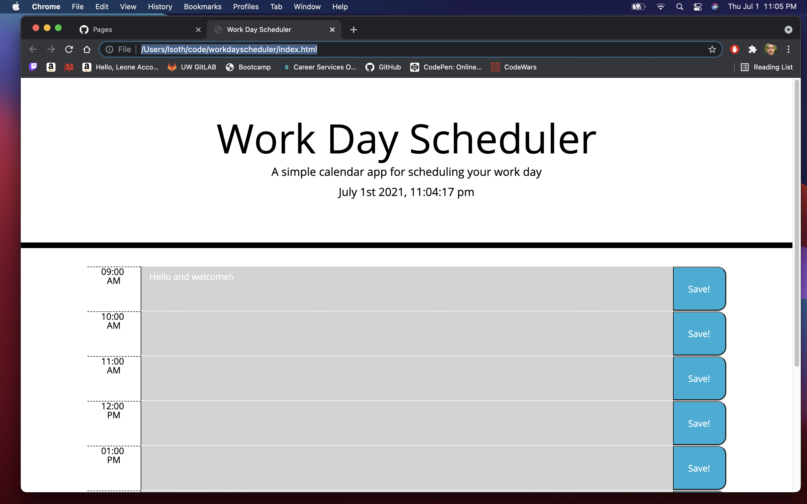

# workdayscheduler
GIVEN I am using a daily planner to create a schedule
WHEN I open the planner
THEN the current day is displayed at the top of the calendar
WHEN I scroll down
THEN I am presented with timeblocks for standard business hours
WHEN I view the timeblocks for that day
THEN each timeblock is color coded to indicate whether it is in the past, present, or future
WHEN I click into a timeblock
THEN I can enter an event
WHEN I click the save button for that timeblock
THEN the text for that event is saved in local storage
WHEN I refresh the page
THEN the saved events persist
## Description

The goal for this project was to create an application that can be used as a work day
planner. There are timeslots for a regular 9 to 5 job, each slot changes color depending on whether or not the time is past, present or future. You can enter text on the textareas adjacent to the times, and save the entries into local storage. Even if the page is refreshed, it will still hold values until local storage is cleared or it is overwritten with another entry.

## Installation

To open the project just visit this url: https://lsoth.github.io/workdayscheduler/

## Usage

Here is an example of what the website looks like: 

## Credits

This project is a culmination of the knowledge provided by classwork, working with fellow classmates and the help of some online resources including:

https://getbootstrap.com/docs/5.0/getting-started/introduction/

https://www.w3schools.com/html/html5_webstorage.asp

https://blog.logrocket.com/localstorage-javascript-complete-guide/

## Licence